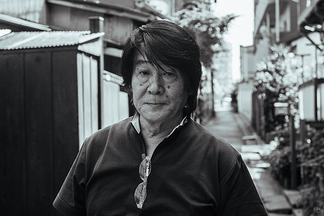

# Moriyama Daidou

{.ui .medium
.centered .image}

森山 大道

A photographer born in Osaka Japan, Daidou's signature style includes poorly
exposed, often blurry photos depecting in the moment events. He is famous for
street #photography. His photos are particularly good at invoking a feeling of
being present in the photo, as if you are the photographer.

He has been awarded multiple times for his works.
